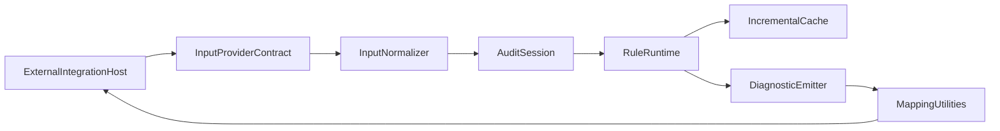

# BetterA11y Core API

[](https://www.npmjs.com/package/bettera11y)

`bettera11y` is the standalone core runtime for BetterA11y.

Use it to run accessibility audits, apply rule presets, and return normalized
diagnostics that can be consumed by separate tooling packages (ESLint, Vite,
Next.js, browser extensions, and custom integrations).

Style auditing is included for inline HTML/JSX styles and raw CSS inputs, with
contrast/readability checks and configurable thresholds.

## Install

```bash
npm install bettera11y
```

## Quick Start

```ts
import { audit, check, recommendedPreset } from "bettera11y";

const result = await audit(`<html><main><h1>Welcome</h1></main></html>`, {
    rules: recommendedPreset,
    filepath: "pages/index.html"
});

const isClean = await check("# Heading", {
    rules: recommendedPreset,
    format: "markdown",
    source: { kind: "inline", label: "Quick note" }
});

const cssAudit = await audit(":root{--fg:#777;--bg:#888}.title{color:var(--fg);background:var(--bg)}", {
    format: "css",
    filepath: "styles.css",
    rules: recommendedPreset,
    ruleOptions: {
        "color-contrast": { minContrastNormal: 4.5, minContrastLarge: 3 }
    }
});

console.log(result.diagnostics);
console.log(isClean);
console.log(cssAudit.diagnostics);
```

## What You Get

- **Core runtime**: run one-shot or incremental audits.
- **Rule presets**: `recommendedPreset`, `strictPreset`, and `wcagAaBaselinePreset`.
- **Diagnostics utilities**: stable IDs, source location helpers, and severity mapping.
- **Style auditing**: contrast/readability checks for inline styles and CSS text/files.
- **Reporting helpers**: pretty, JSON, and machine-oriented output formats.
- **Adapter primitives**: utilities for building integrations in other packages.

## Core API

- `audit(source, options?, signal?)`: one-shot async audit with cancellation support.
- `auditSync(source, options?)`: sync one-shot audit for sync-only rule sets.
- `check(source, options?, signal?)`: boolean helper for pass/fail checks.
- `checkSync(source, options?)`: sync boolean helper.
- `auditIncremental({ changes }, options?, signal?)`: batch-style incremental audit API for local-dev workflows.
- `startAuditSession(options?)`: explicit session lifecycle for file-watcher/dev-server usage.

## Integration Flow



## Rule Presets

- `recommendedPreset`: low-noise default for most integrations.
- `strictPreset`: full core ruleset for strict CI/dev policies.
- `wcagAaBaselinePreset`: WCAG AA oriented baseline.
