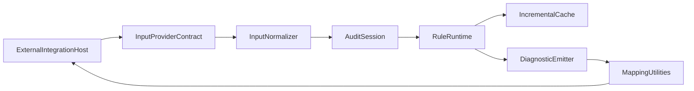

# BetterA11y Core API

`bettera11y` is the standalone, integration-agnostic API layer for BetterA11y.
It is designed to be imported by separate integration packages (ESLint, Vite,
Next.js, browser extension) without embedding any of those runtimes here.

## Install

```bash
npm install bettera11y
```

## Quick Start

```ts
import { createEngine, recommendedPreset } from "bettera11y";

const engine = createEngine(recommendedPreset);
const result = await engine.run({
  kind: "html",
  source: { path: "pages/index.html", language: "html" },
  html: `<html><main><h1>Welcome</h1></main></html>`,
});

console.log(result.diagnostics);
```

## Integration SDK Surface

- `createEngine(initialRules?)`: creates an audit engine instance.
- `createAuditSession()` on engine: long-lived dev server/watch session API.
- `recommendedPreset`, `strictPreset`, `wcagAaBaselinePreset`: production rule presets.
- `MockAdapter`: reference adapter for integration contract testing.
- `createPrettyReporter()`, `createJsonReporter()`, `createMachineReporter()`: output formatting helpers.
- `selectorToSourceLocation()`, `translateSeverity()`, `createDiagnosticFingerprint()`: mapping/translation utilities for external integrations.

### Engine Operations

- `registerRule(rule)` / `unregisterRule(ruleId)`: mutate runtime rule registry.
- `listRules()`: deterministic rule list sorted by rule id.
- `run(input, signal?)`: one-shot async audit with cancellation support.
- `runIncremental({ changes })`: batch-style incremental audit API for local-dev workflows.
- `createAuditSession()`: explicit session lifecycle for file-watcher/dev-server usage.

## Session Data Flow



## Rule Presets

- `recommendedPreset`: low-noise default for most integrations.
- `strictPreset`: full core ruleset for strict CI/dev policies.
- `wcagAaBaselinePreset`: WCAG AA oriented baseline.

## Semver and Stability

- `BETTERA11Y_API_VERSION` provides protocol-level compatibility signaling.
- Top-level exports are semver-governed and contract-tested.
- Existing rule ids and diagnostic shape are compatibility-sensitive.
- Breaking changes to public contracts require a major version bump.

## Changelog Policy

This project follows Keep a Changelog style entries and semantic versioning.
See `CHANGELOG.md` for release notes.

## Release Process

- Commits must follow the Conventional Commits format (`feat:`, `fix:`, optional scope, and `BREAKING CHANGE` footer when needed).
- GitHub Actions enforces commit formatting on pull requests via commitlint.
- On merges to `main`, Release Please opens or updates a Release PR that:
  - updates `CHANGELOG.md`
  - bumps `package.json` version according to SemVer rules inferred from commits
- When the Release PR is merged, GitHub creates a release and a publish workflow releases the package to npm.

Required repository secret:

- `NPM_TOKEN` with publish access for the npm package.
