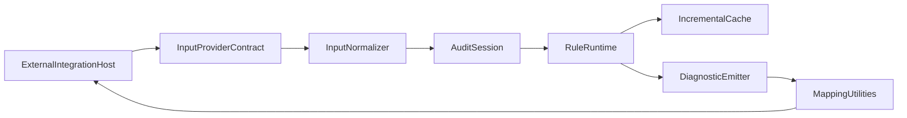

# BetterA11y Core API

[](https://www.npmjs.com/package/bettera11y)

`bettera11y` is the standalone core engine for BetterA11y.

Use it to run accessibility audits, apply rule presets, and return normalized
diagnostics that can be consumed by separate tooling packages (ESLint, Vite,
Next.js, browser extensions, and custom integrations).

## Install

```bash
npm install bettera11y
```

## Quick Start

```ts
import { createEngine, recommendedPreset } from "bettera11y";

const engine = createEngine(recommendedPreset);
const result = await engine.run({
  kind: "html",
  source: { path: "pages/index.html", language: "html" },
  html: `<html><main><h1>Welcome</h1></main></html>`,
});

console.log(result.diagnostics);
```

## What You Get

- **Audit engine**: run one-shot or incremental audits.
- **Rule presets**: `recommendedPreset`, `strictPreset`, and `wcagAaBaselinePreset`.
- **Diagnostics utilities**: stable IDs, source location helpers, and severity mapping.
- **Reporting helpers**: pretty, JSON, and machine-oriented output formats.
- **Adapter primitives**: utilities for building integrations in other packages.

## Core API

- `registerRule(rule)` / `unregisterRule(ruleId)`: mutate runtime rule registry.
- `listRules()`: deterministic rule list sorted by rule id.
- `run(input, signal?)`: one-shot async audit with cancellation support.
- `runIncremental({ changes })`: batch-style incremental audit API for local-dev workflows.
- `createAuditSession()`: explicit session lifecycle for file-watcher/dev-server usage.

## Integration Flow



## Rule Presets

- `recommendedPreset`: low-noise default for most integrations.
- `strictPreset`: full core ruleset for strict CI/dev policies.
- `wcagAaBaselinePreset`: WCAG AA oriented baseline.
